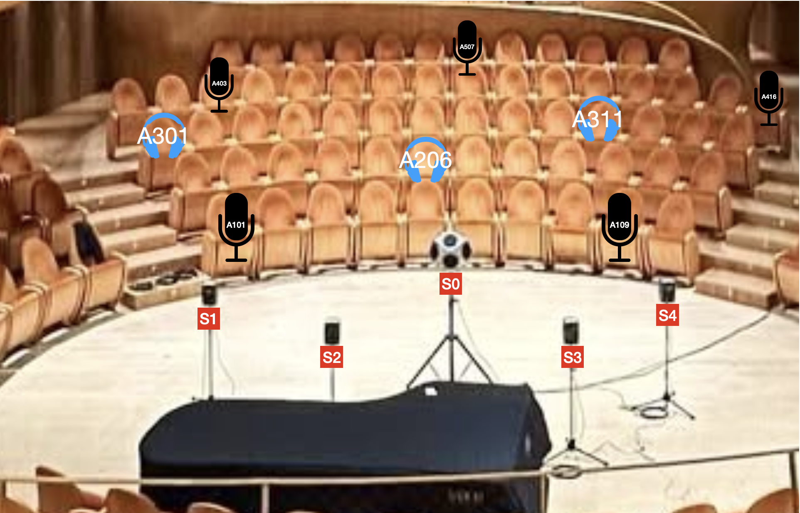

# Graph Neural Network for Wide Area 6DoF Sound Field Reconstruction

## Abstract of the thesis
Sound Field Reconstruction is one of the fundamental problems in acoustic engineering, and yet it still lacks a definitive solution, especially for sparse microphone regimes. By framing a network of Ambisonics receiver placed in a given environment as a spatial graph, this thesis proposes a solution to this challenge by exploring the application of Graph Neural Networks. Sound information captured by each microphone is represented by Directional Audio Coding parameters, which are encoded and propagated through the graph via a message-passing paradigm. The aggregation of this information at the query positions allows the model to retrieve the weights needed to interpolate the parameters for unmeasured locations from the parameters of the known microphone signals. The proposed architecture is tested against a well-known deterministic geometric interpolation algorithm, renowned for its robustness despite its conceptual simplicity. While the proposed model does not universally outperform the baseline across all regimes, it demonstrates competitive analytical and perceptual results when operating with a small number of microphones. 

## Instructions
In order to run the example, just download the folder and run the Matlab script "main.m". In the image below, the setting for receivers and SMAs reported in the example is shown. It is possible to select up to two sources according to your preference by writing SO, S1, S2, S3 or S4 next to SOURCE_NAME_1 and SOURCE_NAME_2 at the beginning of the code.

